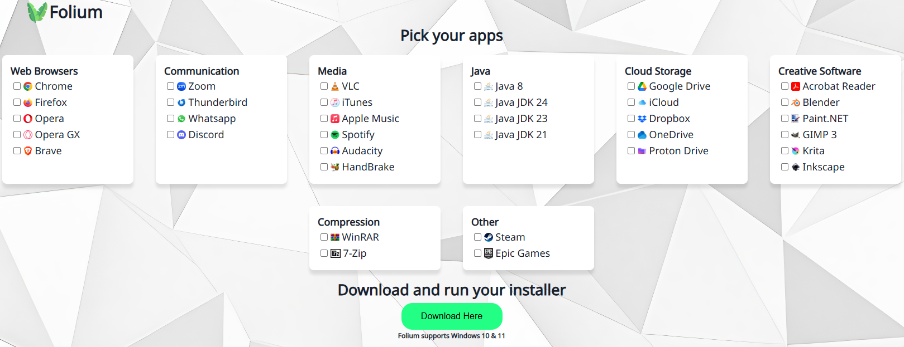

 <a href="https://brybry-ink.github.io/Folium/"> 

<h1 align="center">Folium - Install Multiple Apps at Once</h1>

Website batch creator for any needed applications

 <a href="https://brybry-ink.github.io/Folium/"> 
  
## What is Folium?
Folium is a web app that lets users select desired applications with a friendly user interface and generates a .bat file for automated installation. Whether you're setting up a new PC or helping a friend, Folium simplifies bulk software installs into a few clicks.
Website generated files are entirely local.

## How to Use?
1. Visit the site: [Folium](https://brybry-ink.github.io/Folium/)
2. Select your desired applications
3. Click "Download Here"
4. Run the downloaded .bat file to install selected applications

## Built With
- [WinGet](https://github.com/microsoft/winget-cli) - Windows package manager
- HTML, CSS, JavaScript
